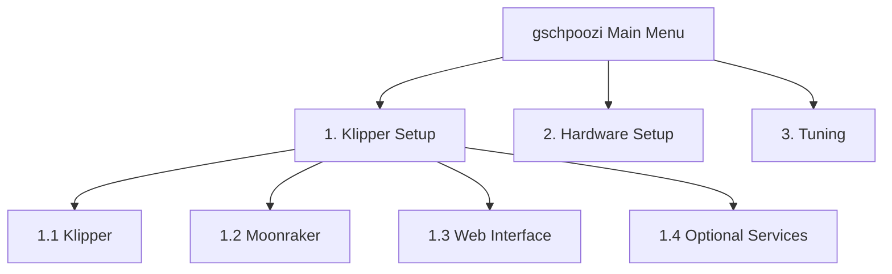
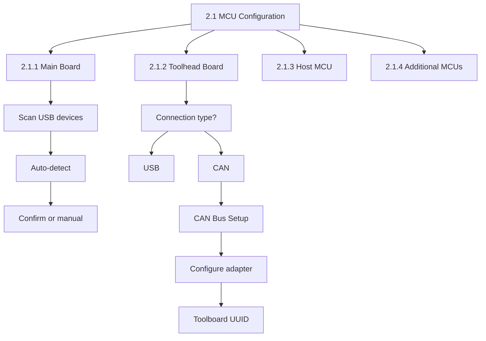
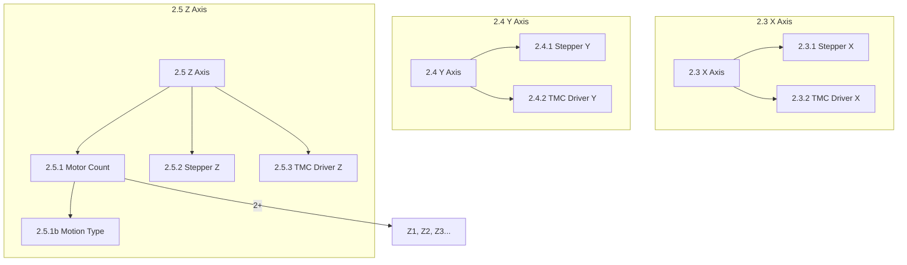
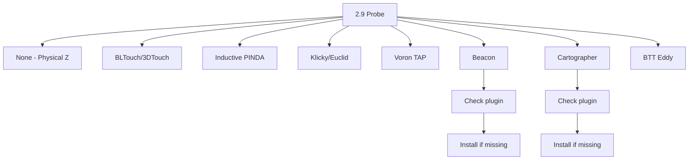
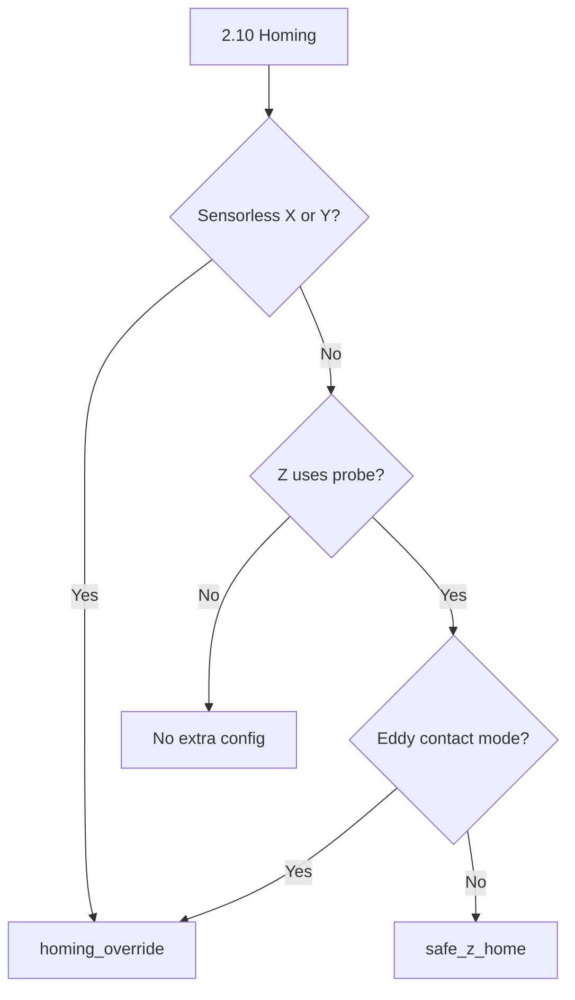
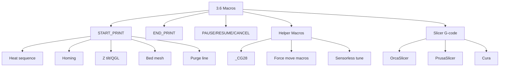

# gschpoozi Wizard Menu Structure

Complete specification for the gschpoozi configuration wizard.
Each menu item maps directly to Klipper config sections with detailed parameters.

**Version:** 2.0 (Refactor)  
**Status:** Approved - Ready for Implementation

---

## Table of Contents

1. [Menu ID System](#menu-id-system)
2. [Output File Structure](#output-file-structure)
3. [Category 1: Klipper Setup](#category-1-klipper-setup)
4. [Category 2: Hardware Setup](#category-2-hardware-setup)
5. [Category 3: Tuning & Optimization](#category-3-tuning--optimization)
6. [Design Decisions](#design-decisions)
7. [Mermaid Flowcharts](#mermaid-flowcharts)

---

## Menu ID System

Menu IDs use decimal hierarchy:
- `1.x` = Klipper Setup (installation, verification)
- `2.x` = Hardware Setup (generates printer.cfg)
- `3.x` = Tuning & Optimization

---

## Output File Structure

### Generated Files

```
~/printer_data/config/
├── printer.cfg                    # Main file (minimal, just includes)
├── user-overrides.cfg             # User customizations (PRESERVED on regenerate)
└── gschpoozi/
    ├── mcu.cfg                    # [mcu], [mcu toolboard], serial/CAN paths
    ├── printer-settings.cfg       # [printer], [virtual_sdcard], [idle_timeout]
    ├── steppers.cfg               # [stepper_*] + [tmc2209 stepper_*] combined
    ├── extruder.cfg               # [extruder] + [tmc2209 extruder]
    ├── heater-bed.cfg             # [heater_bed], [verify_heater]
    ├── fans.cfg                   # All fan sections
    ├── probe.cfg                  # Probe config (any type)
    ├── homing.cfg                 # [safe_z_home] or [homing_override]
    ├── leveling.cfg               # [bed_mesh], [z_tilt], [quad_gantry_level]
    ├── sensors.cfg                # Temperature + filament sensors
    ├── leds.cfg                   # LEDs (if configured)
    ├── display.cfg                # Display (if configured)
    ├── input-shaper.cfg           # [input_shaper], accelerometer config
    ├── macros.cfg                 # User-facing macros (START_PRINT, etc.)
    ├── macros-helpers.cfg         # Internal helpers (_CG28, force_move, etc.)
    └── extras.cfg                 # [exclude_object], [gcode_arcs], [respond]
```

### Regeneration Behavior

| File/Folder | On Regenerate |
|-------------|---------------|
| `printer.cfg` | Overwrite |
| `gschpoozi/` | Overwrite completely |
| `user-overrides.cfg` | **PRESERVE** (never touch) |

### printer.cfg Template

```ini
# printer.cfg - Generated by gschpoozi
# Put your customizations in user-overrides.cfg

[include gschpoozi/mcu.cfg]
[include gschpoozi/printer-settings.cfg]
[include gschpoozi/steppers.cfg]
[include gschpoozi/extruder.cfg]
[include gschpoozi/heater-bed.cfg]
[include gschpoozi/fans.cfg]
[include gschpoozi/sensors.cfg]
[include gschpoozi/probe.cfg]
[include gschpoozi/homing.cfg]
[include gschpoozi/leveling.cfg]
[include gschpoozi/leds.cfg]
[include gschpoozi/display.cfg]
[include gschpoozi/input-shaper.cfg]
[include gschpoozi/macros.cfg]
[include gschpoozi/macros-helpers.cfg]
[include gschpoozi/extras.cfg]

# User customizations (PRESERVED on regenerate)
[include user-overrides.cfg]

#*# <---------------------- SAVE_CONFIG ---------------------->
#*# DO NOT EDIT THIS BLOCK OR BELOW.
```

---

## Category 1: Klipper Setup

Installation verification only - no config output.

### 1.1 Klipper Installation
- Verify Klipper is installed
- Check service status
- MCU firmware guidance

### 1.2 Moonraker
- Verify Moonraker is installed
- Check API access

### 1.3 Web Interface
- 1.3.1 Mainsail
- 1.3.2 Fluidd

### 1.4 Optional Services
- 1.4.1 Crowsnest (camera)
- 1.4.2 KlipperScreen
- 1.4.3 Timelapse
- 1.4.4 Sonar

---

## Category 2: Hardware Setup

### 2.1 MCU Configuration

#### 2.1.1 Main Board → `[mcu]`

| Parameter | Type | Required | Notes |
|-----------|------|----------|-------|
| board_type | Select | Yes | From templates/boards/ |
| connection_type | Choice | Yes | USB only (CAN removed) |
| serial | Auto/Manual | Yes | Auto-detect with fallback |
| restart_method | Choice | Yes | command (default) |

**Enforcement:** Main board is required - wizard cannot proceed without it.

**Connection flow:**
1. Scan for connected MCUs
2. Show detected devices
3. User confirms or enters manually

#### 2.1.2 Toolhead Board → `[mcu toolboard]`

| Parameter | Type | Required | Notes |
|-----------|------|----------|-------|
| enabled | bool | No | Add toolhead board? |
| board_type | Select | If yes | From templates/toolboards/ |
| connection_type | Choice | Yes | USB / CAN |
| serial | Auto/Manual | If USB | |
| canbus_uuid | Auto/Manual | If CAN | |
| canbus_bitrate | Choice | If CAN | 1000000, 500000, 250000 |

**If CAN selected → triggers CAN bus setup sub-wizard:**
1. Check if CAN adapter already configured
2. If not: configure CAN adapter (2.1.2a)
3. Then configure toolboard

#### 2.1.2a CAN Bus Setup (conditional)

| Parameter | Type | Notes |
|-----------|------|-------|
| adapter_type | Choice | USB-CAN adapter / USB-CAN Bridge |
| **USB-CAN Adapter:** | | |
| adapter_model | Select | From templates/can-adapters/ |
| bitrate | Choice | 1000000, 500000, 250000 |
| **USB-CAN Bridge:** | | |
| bridge_board | Select | Main board with CAN (if supported) |

**Reference:** [CAN Bus Guide](https://canbus.esoterical.online/)

#### 2.1.3 Host MCU → `[mcu rpi]`

| Parameter | Type | Notes |
|-----------|------|-------|
| enabled | bool | Enable for ADXL, GPIO, etc. |

```ini
[mcu rpi]
serial: /tmp/klipper_host_mcu
```

#### 2.1.4 Additional MCUs → `[mcu name]`

For multi-board setups beyond main + toolboard.

| Parameter | Type | Notes |
|-----------|------|-------|
| name | text | MCU identifier |
| connection_type | Choice | USB / Serial / CAN |
| serial/canbus_uuid | Auto/Manual | |

---

### 2.2 Printer Settings → `[printer]`

| Parameter | Type | Required | Default | Notes |
|-----------|------|----------|---------|-------|
| kinematics | Choice | Yes | - | corexy, cartesian, corexz, delta |
| max_velocity | int | Yes | 300 | mm/s |
| max_accel | int | Yes | 3000 | mm/s² |
| max_z_velocity | int | Yes | 15 | mm/s |
| max_z_accel | int | Yes | 350 | mm/s² |
| square_corner_velocity | float | No | 5.0 | mm/s |
| minimum_cruise_ratio | float | No | 0.5 | Optional |
| **Bed Size** | | | | |
| bed_size_x | int | Yes | - | Used for mesh, homing |
| bed_size_y | int | Yes | - | |
| bed_size_z | int | Yes | - | Z height |

---

### 2.3 X Axis

#### 2.3.1 Stepper X → `[stepper_x]`

| Parameter | Type | Required | Notes |
|-----------|------|----------|-------|
| motor_port | Select | Yes | Board motor_ports |
| **Motion** | | | |
| belt_pitch | Choice | Yes | 2mm GT2, 3mm HTD, 1.5mm (rare) |
| pulley_teeth | Choice | Yes | 16, 20, 24, 32, 40 |
| microsteps | Choice | Yes | 16, 32, 64 |
| full_steps_per_rotation | Choice | Yes | 200 (1.8°), 400 (0.9°) |
| dir_pin_inverted | bool | No | Manual direction invert |
| **Endstop** | | | |
| endstop_type | Choice | Yes | Physical / Sensorless |
| endstop_port | Select | If physical | Board endstop_ports |
| endstop_config | Choice | If physical | NC to GND (^pin), NO to GND (^!pin), NC to VCC (!pin), NO to VCC (pin) |
| **Position** | | | |
| position_endstop | int | Yes | |
| position_min | int | Yes | Usually 0 |
| position_max | int | Yes | Usually bed_size_x |
| **Homing** | | | |
| homing_speed | int | Yes | Default: 50-80 |
| homing_retract_dist | float | Yes | 5 for physical, 0 for sensorless |
| second_homing_speed | int | No | Default: 10-20 |

**rotation_distance calculated:** `belt_pitch × pulley_teeth`

#### 2.3.2 TMC Driver X → `[tmc2209 stepper_x]`

| Parameter | Type | Required | Notes |
|-----------|------|----------|-------|
| driver_type | Choice | Yes | TMC2209, TMC5160, TMC2130, TMC2660 |
| run_current | float | Yes | Motor-dependent |
| interpolate | bool | No | Default: false |
| UART/SPI pins | Auto | Yes | From board template |
| **Sensorless (if enabled)** | | | |
| diag_pin | Auto | Yes | From board |
| driver_SGTHRS | int | Yes | Default: 70 |

**Motor current presets:**
| Motor | run_current |
|-------|-------------|
| LDO-42STH48-2004MAH | 1.1A |
| Moons MS17HD6P4200 | 1.1A |
| OMC 17HS19-2004S1 | 1.0A |

#### 2.3.3 Stepper X1 (AWD only) → `[stepper_x1]`
Same structure, only if AWD kinematics.

---

### 2.4 Y Axis

Same structure as 2.3 X Axis.

---

### 2.5 Z Axis

#### 2.5.1 Z Motor Configuration

| Parameter | Type | Notes |
|-----------|------|-------|
| z_motor_count | Choice | 1, 2, 3, 4 |
| z_motion_type | Choice | Gantry moves / Bed moves (if count=2) |

**Auto-selection:**
| Count | Motion | Leveling Method |
|-------|--------|-----------------|
| 1 | - | None |
| 2 | Gantry | `[z_tilt]` |
| 2 | Bed | `[bed_tilt]` |
| 3 | Gantry | `[z_tilt]` |
| 4 | Gantry | `[quad_gantry_level]` |

#### 2.5.2 Stepper Z → `[stepper_z]`

| Parameter | Type | Required | Notes |
|-----------|------|----------|-------|
| motor_port | Select | Yes | |
| **Drive type** | Choice | Yes | Leadscrew / Belt |
| leadscrew_pitch | Choice | If leadscrew | 8mm T8, 4mm, 2mm, Custom |
| belt_pitch | Choice | If belt | 2mm, 3mm |
| pulley_teeth | Choice | If belt | 16, 20, etc. |
| gear_ratio | text | No | e.g., "80:16" |
| microsteps | Choice | Yes | |
| full_steps_per_rotation | Choice | Yes | |
| dir_pin_inverted | bool | No | |
| **Endstop** | | | |
| endstop_type | Choice | Yes | Probe / Physical on mainboard / Physical on toolboard / Sensorless |
| physical_port | Select | If physical | |
| switch_config | Choice | If physical | NC/NO, pullup, invert |
| **Position** | | | |
| position_min | int | Yes | Default: -5 |
| position_max | int | Yes | From bed_size_z |
| **Homing** | | | |
| homing_speed | int | Yes | Default: 10-15 |
| homing_retract_dist | float | Yes | 0 for probe, 5 for physical |

#### 2.5.3-2.5.9 Additional Z Steppers
Same pattern for Z1, Z2, Z3 based on motor count.

---

### 2.6 Extruder

#### 2.6.1 Extruder Count
Single extruder for v1. Multi-extruder deferred.

#### 2.6.2 Motor Location

| Parameter | Type | Notes |
|-----------|------|-------|
| location | Choice | Mainboard / Toolboard |
| motor_port | Select | Based on location |

#### 2.6.3 Extruder Type → Sets rotation_distance, gear_ratio

| Extruder | rotation_distance | gear_ratio |
|----------|------------------|------------|
| Sherpa Mini | 22.67895 | 50:10 |
| Orbiter v2.0/v2.5 | 4.637 | 7.5:1 |
| Smart Orbiter v3 | 4.69 | 7.5:1 |
| Clockwork 2 | 22.6789511 | 50:10 |
| Galileo 2 | 47.088 | 9:1 |
| LGX Lite | 8 | 44:8 |
| BMG | 22.6789511 | 50:17 |
| VZ-Hextrudort 8T | 22.2 | 50:8 |
| VZ-Hextrudort 10T | 22.2 | 50:10 |
| Custom | Manual | Manual |

**Mandatory selection** - sets rotation_distance and gear_ratio automatically.

#### 2.6.4 Motor Configuration

| Parameter | Type | Notes |
|-----------|------|-------|
| dir_pin_inverted | bool | |
| microsteps | Choice | 16, 32 |
| full_steps_per_rotation | Choice | 200, 400 |

#### 2.6.5 Hotend Configuration

| Parameter | Type | Notes |
|-----------|------|-------|
| nozzle_diameter | Choice | 0.4, 0.5, 0.6, 0.8, 1.0 |
| filament_diameter | Choice | 1.75, 2.85 |
| **Heater** | | |
| heater_location | Choice | Mainboard / Toolboard |
| heater_port | Select | |
| max_power | float | Default: 1.0 |
| **Thermistor** | | |
| sensor_location | Choice | Mainboard / Toolboard |
| sensor_type | Choice | Generic 3950, ATC Semitec 104GT-2, PT1000, etc. |
| sensor_port | Select | |
| pullup_resistor | Choice/Custom | 4700, 2200, 10000, Custom |
| **Temperature** | | |
| min_temp | int | Default: 0 |
| max_temp | int | Based on thermistor |

**Warning if heater/sensor on different boards.**

#### 2.6.6 Extrusion Settings

| Parameter | Type | Default (DD) | Default (Bowden) |
|-----------|------|--------------|------------------|
| drive_type | Choice | Direct Drive | - |
| max_extrude_only_distance | int | 150 | 500 |
| max_extrude_cross_section | float | 5 | 5 |
| min_extrude_temp | int | 170 | 170 |
| instantaneous_corner_velocity | float | 1.0 | 1.0 |

#### 2.6.7 Pressure Advance
From extruder type preset - calibrate later.

#### 2.6.8 PID Values
Placeholder - calibrate after first boot.

#### 2.6.9 TMC Driver Extruder
Same pattern as X/Y TMC, pins from motor location.

---

### 2.7 Heated Bed → `[heater_bed]`

| Parameter | Type | Notes |
|-----------|------|-------|
| heater_port | Select | Board heater_ports |
| max_power | float | Default: 1.0 |
| **Thermistor** | | |
| sensor_type | Choice | Generic 3950, Keenovo, etc. |
| sensor_port | Select | |
| pullup_resistor | Choice/Custom | |
| **Temperature** | | |
| heater_type | Choice | DC pad, AC silicone, Cast-in |
| min_temp | int | Default: 0 |
| max_temp | int | Based on heater type |
| **PWM** | | |
| pwm_cycle_time | float | Default: 0.1 |
| smooth_time | float | Default: 1.0 |
| **PID** | | |
| pid_Kp/Ki/Kd | float | Placeholder |

#### 2.7.7 Heater Verification (Advanced)
`[verify_heater heater_bed]` - collapsible advanced settings.

---

### 2.8 Fans

All fans share common parameters:
- pin_location (Mainboard/Toolboard)
- pin
- pin_inverted
- max_power, cycle_time, kick_start_time, off_below
- tachometer_pin, tachometer_ppr (if applicable)
- enable_pin (if board has it)

#### 2.8.1 Part Cooling → `[fan]`
Multi-pin support via `[multi_pin]`.

#### 2.8.2 Hotend Fan → `[heater_fan hotend_fan]`
heater, heater_temp, fan_speed

#### 2.8.3 Controller Fan → `[controller_fan]`
stepper, idle_timeout, idle_speed

#### 2.8.4-2.8.8 Additional Fans
Exhaust, Chamber, RSCS, Nevermore, Additional - as `[fan_generic]` or `[temperature_fan]`.

---

### 2.9 Probe

#### 2.9.1 Probe Type Selection

| Type | Klipper Section | Connection |
|------|-----------------|------------|
| None | - | Physical Z endstop |
| BLTouch/3DTouch/CR-Touch | `[bltouch]` | Servo + signal |
| Inductive (PINDA) | `[probe]` | Signal |
| Klicky/Euclid | `[probe]` + macros | Signal |
| Voron TAP | `[probe]` | Toolhead signal |
| Beacon | `[beacon]` | USB/CAN |
| Cartographer | `[scanner]` | USB/CAN |
| BTT Eddy | `[probe_eddy_current]` | I2C/USB |

**Plugin check:** Beacon/Cartographer require Klipper plugins - check/offer install.

#### 2.9.2-2.9.3 Probe Configuration
Type-specific parameters + common settings (speed, samples, offsets).

**z_offset:** Set to 0, remind user to calibrate.

**Auto-populate bed_mesh** based on probe offsets.

---

### 2.10 Homing Configuration

#### 2.10.1-2.10.2 X/Y Homing
From stepper endstop config.

#### 2.10.3-2.10.6 Z Homing

**Decision tree:**
- Sensorless X or Y → `[homing_override]`
- Probe Z (standard) → `[safe_z_home]`
- Eddy contact mode → `[homing_override]`
- Physical Z only → No extra config

**Sensorless tuning macros** included:
- `_SENSORLESS_TUNE_X`
- `_SENSORLESS_TUNE_Y`

---

### 2.11 Bed Leveling

**Auto-calculated from bed_size + probe_offsets:**
- User only configures: margin, probe_count
- mesh_min/max calculated automatically

#### 2.11.1 Bed Mesh → `[bed_mesh]`
#### 2.11.2 Z Tilt → `[z_tilt]` (2-3 Z motors, gantry moves)
#### 2.11.3 Bed Tilt → `[bed_tilt]` (2 Z motors, bed moves)
#### 2.11.4 QGL → `[quad_gantry_level]` (4 Z motors)
#### 2.11.5 Screws Tilt Adjust → `[screws_tilt_adjust]`

**KAMP mentioned** as optional addon for future.

---

### 2.12 Temperature Sensors

**Enabled by default:**
- MCU temperature (mainboard + toolboard)
- Host temperature (Raspberry Pi)

**Optional:**
- Chamber sensor
- Frame/ambient sensor

---

### 2.13 LEDs & Lighting

- Chamber light (`[output_pin]`)
- Neopixel strips (`[neopixel]`)
- Toolhead LEDs (Stealthburner preset)
- Dotstar (`[dotstar]`)
- PWM RGB (`[led]`)

**hardware_pwm option** exposed for smoother dimming.

**LED_Effect plugin** mentioned as optional addon.

---

### 2.14 Filament Sensors

- Switch sensor (`[filament_switch_sensor]`)
- Motion sensor (`[filament_motion_sensor]`)
- BTT Smart (both modes)

Pin modifiers for switch pins.
Runout behavior templates.
Link to BTT Smart sensor documentation.

---

### 2.15 Display

- Mini 12864
- RepRapDiscount Full Graphic
- Basic 20x4 LCD
- Small OLED

EXP pins from board template + verification hint with documentation link.
menu_timeout and menu_root exposed.

---

### 2.16 Advanced Hardware

#### 2.16.1 Output Pins → `[output_pin]`
#### 2.16.2 Power Control
#### 2.16.3 GCode Buttons → `[gcode_button]`
#### 2.16.4 Servo Motors → `[servo]`
#### 2.16.7 Additional MCUs → `[mcu name]`

#### 2.16.8 Force Move → `[force_move]`

Enabled with helper macros:
- `FORCE_Z_UP` / `FORCE_Z_DOWN`
- `FORCE_NUDGE AXIS=Z DIST=10`
- `SET_POSITION_MANUAL X=0 Y=0 Z=0`

---

## Category 3: Tuning & Optimization

### 3.1 TMC Autotune
Plugin check + motor database selection.

### 3.2 Input Shaper → `[input_shaper]`
Accelerometer config (ADXL345, LIS2DW, Beacon built-in).
Placeholder values - calibrate later.

### 3.3-3.5 Calibration Reminders
- Pressure Advance (from extruder type)
- Extruder calibration (rotation_distance)
- PID tuning commands

### 3.6 Macros

Essential macros generated:
- START_PRINT
- END_PRINT
- PAUSE / RESUME / CANCEL_PRINT
- M600 (filament change)
- LOAD_FILAMENT / UNLOAD_FILAMENT
- _CG28 (conditional homing)

**Slicer-specific start g-code** generated for:
- OrcaSlicer / PrusaSlicer
- Cura

### 3.7 Firmware Retraction → `[firmware_retraction]`
Optional.

### 3.8 Skew Correction → `[skew_correction]`
Optional - calibrate later.

### 3.9 Exclude Object → `[exclude_object]`
Enabled by default.

### 3.10 Arc Support → `[gcode_arcs]`
Enabled by default.

### 3.11-3.15 Always Included
- `[respond]`
- `[pause_resume]`
- `[virtual_sdcard]`
- `[idle_timeout]`
- `[save_variables]`

---

## Design Decisions

| Decision | Choice |
|----------|--------|
| UI Framework | whiptail (Python whiptail-dialogs) |
| Schema Format | YAML (menu + config templates) |
| Pin modifiers | Expose pull-up (^) and invert (!) for all input pins |
| Auto-calculation | Bed mesh, z_positions from bed size + probe offsets |
| Slicer integration | Generate start g-code per slicer (Orca/Prusa/Cura) |
| Plugin handling | Check + offer install (Beacon, Cartographer, TMC Autotune) |
| Macros | Generate custom based on hardware config |
| Output structure | Minimal printer.cfg + gschpoozi/ folder + user-overrides.cfg |
| Steppers + TMC | Combined in single steppers.cfg file |
| Regeneration | Overwrite all except user-overrides.cfg (always preserved) |
| Main board connection | USB only (CAN removed from 2.1.1) |
| Toolboard CAN | Triggers CAN bus setup sub-wizard |
| Z motion type | Ask gantry vs bed for 2-motor Z |
| Endstop on toolboard | Supported for Z endstop (Klicky etc.) |

---

## Mermaid Flowcharts

### Main Menu Overview



### Hardware Setup - MCU Flow



### Motion System Flow



### Probe Selection Flow



### Homing Decision Tree



### Macro Generation Flow



---

## Config Section Mapping

| Menu ID | Klipper Section | Required |
|---------|-----------------|----------|
| 2.1.1 | `[mcu]` | Yes |
| 2.1.2 | `[mcu toolboard]` | No |
| 2.1.3 | `[mcu rpi]` | No |
| 2.2 | `[printer]` | Yes |
| 2.3.1 | `[stepper_x]` | Yes |
| 2.3.2 | `[tmc2209 stepper_x]` | Yes |
| 2.4.1 | `[stepper_y]` | Yes |
| 2.4.2 | `[tmc2209 stepper_y]` | Yes |
| 2.5.2 | `[stepper_z]` | Yes |
| 2.5.3 | `[tmc2209 stepper_z]` | Yes |
| 2.6 | `[extruder]` | Yes |
| 2.7 | `[heater_bed]` | Yes |
| 2.8.1 | `[fan]` | Yes |
| 2.8.2 | `[heater_fan]` | Recommended |
| 2.9 | `[probe]`/`[beacon]`/`[bltouch]` | Recommended |
| 2.10.4 | `[safe_z_home]` | If probe |
| 2.10.5 | `[homing_override]` | If sensorless/eddy |
| 2.11.1 | `[bed_mesh]` | If probe |
| 2.11.2-4 | `[z_tilt]`/`[quad_gantry_level]` | Multi-Z |
| 3.1 | `[autotune_tmc]` | Optional |
| 3.2 | `[input_shaper]` | Recommended |

---

## Implementation Notes

### Bootstrap (configure.sh)
```bash
#!/bin/bash
# Check/install whiptail binary
if ! command -v whiptail &> /dev/null; then
    sudo apt-get update && sudo apt-get install -y whiptail
fi

# Check/install Python whiptail-dialogs
if ! python3 -c "import whiptail" &> /dev/null 2>&1; then
    pip3 install whiptail-dialogs
fi

# Launch Python wizard
python3 "$(dirname "$0")/wizard/main.py" "$@"
```

### Pin Modifiers
All endstop/switch pins support:
- `^` = pull-up resistor
- `!` = inverted logic
- `^!` = both

Common: NC switch to GND = `^pin` (recommended default)

### Auto-Detection
- MCU serial paths: Scan `/dev/serial/by-id/`
- CAN UUIDs: `~/klippy-env/bin/python ~/klipper/scripts/canbus_query.py can0`

---

## Feedback

This specification is approved for implementation.
Submit issues via GitHub for any discovered gaps.
