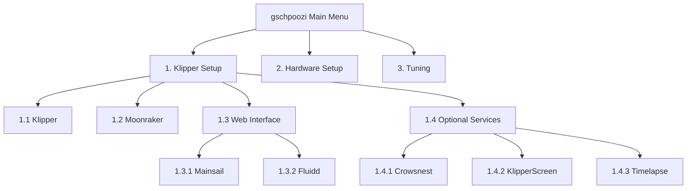
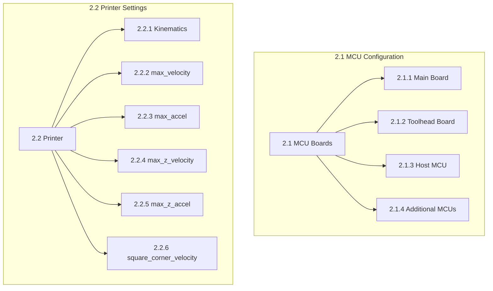
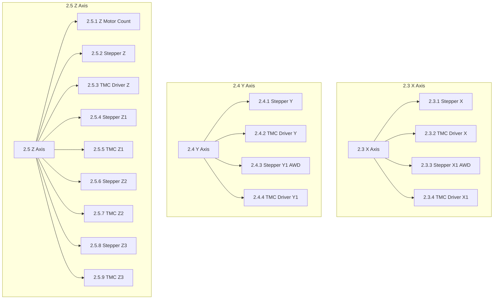
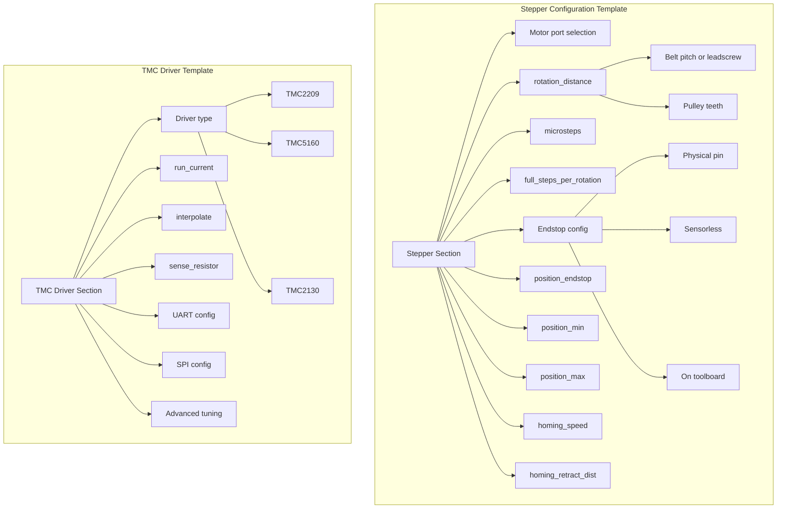
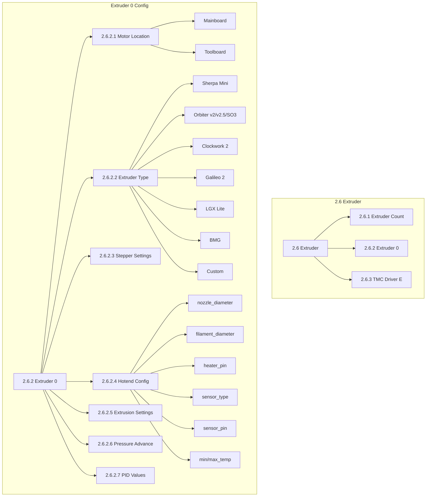
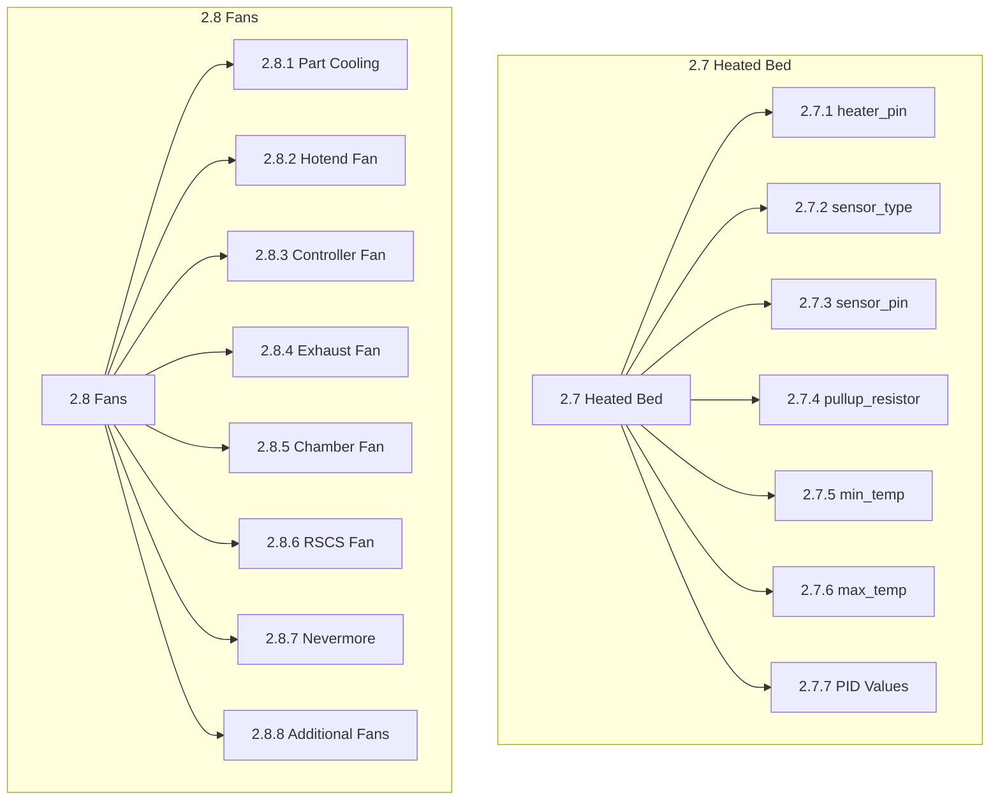
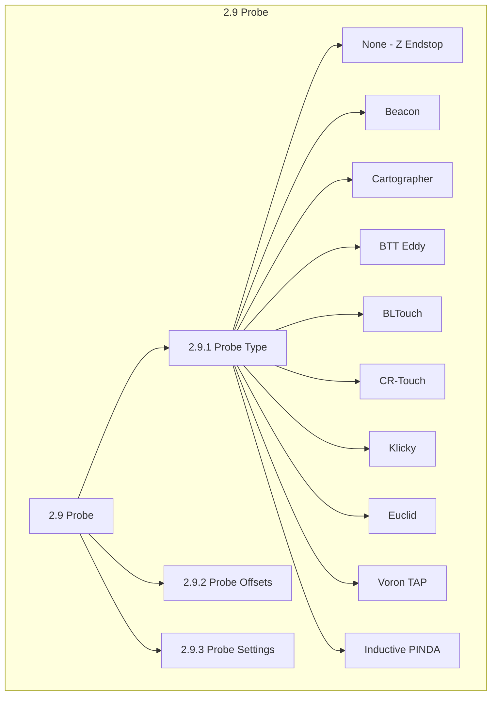
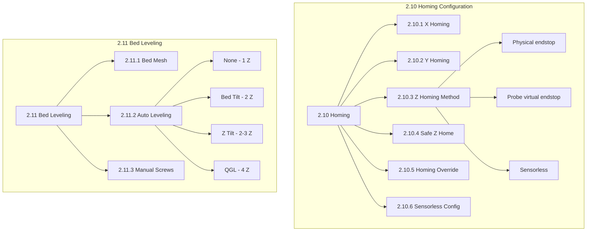
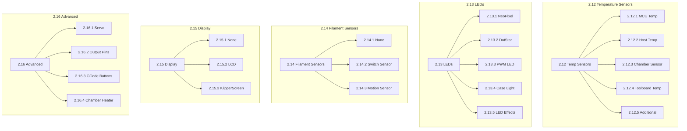
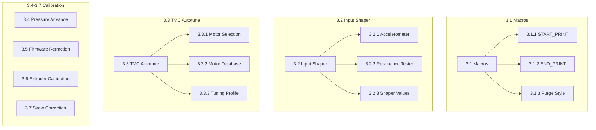

# gschpoozi Wizard Menu Structure

This document defines the complete menu structure for the gschpoozi configuration wizard.
Each menu item maps directly to Klipper config sections.

**Version:** 2.0 (Refactor)  
**Status:** Draft - Open for Review

---

## Menu ID System

Menu IDs use decimal hierarchy:
- `1.x` = Klipper Setup (installation, no config output)
- `2.x` = Hardware Setup (generates printer.cfg)
- `3.x` = Tuning & Optimization

---

## Complete Menu Structure (Text)

```
0. MAIN MENU
├── 1. Klipper Setup (Installation)
├── 2. Hardware Setup (Configuration)
└── 3. Tuning & Optimization

1. KLIPPER SETUP (no config output - installation only)
├── 1.1 Klipper
├── 1.2 Moonraker
├── 1.3 Web Interface
│   ├── 1.3.1 Mainsail
│   └── 1.3.2 Fluidd
└── 1.4 Optional Services
    ├── 1.4.1 Crowsnest (camera streaming)
    ├── 1.4.2 KlipperScreen
    ├── 1.4.3 Timelapse
    └── 1.4.4 Sonar (network keepalive)

2. HARDWARE SETUP
├── 2.1 MCU Configuration
│   ├── 2.1.1 Main Board                    → [mcu]
│   │   ├── Board selection (from templates/boards/)
│   │   └── Serial ID / CAN UUID
│   ├── 2.1.2 Toolhead Board                → [mcu toolboard]
│   │   ├── Toolboard selection (from templates/toolboards/)
│   │   ├── Connection type (USB / CAN)
│   │   └── Serial ID / CAN UUID
│   ├── 2.1.3 Host MCU                      → [mcu rpi]
│   │   └── Enable host MCU (for ADXL, GPIO, etc.)
│   └── 2.1.4 Additional MCUs               → [mcu name]
│       └── MMU, expansion boards, etc.
│
├── 2.2 Printer Settings                    → [printer]
│   ├── 2.2.1 Kinematics
│   │   ├── CoreXY
│   │   ├── CoreXY AWD (All Wheel Drive)
│   │   ├── Cartesian
│   │   └── CoreXZ
│   ├── 2.2.2 max_velocity
│   ├── 2.2.3 max_accel
│   ├── 2.2.4 max_z_velocity
│   ├── 2.2.5 max_z_accel
│   └── 2.2.6 square_corner_velocity
│
├── 2.3 X Axis
│   ├── 2.3.1 Stepper X                     → [stepper_x]
│   │   ├── 2.3.1.1 Motor port (MOTOR_0, MOTOR_1, etc.)
│   │   ├── 2.3.1.2 rotation_distance
│   │   │   ├── Belt pitch (2mm GT2, 3mm HTD)
│   │   │   └── Pulley teeth (16T, 20T, etc.)
│   │   ├── 2.3.1.3 microsteps (16, 32, 64, 128, 256)
│   │   ├── 2.3.1.4 full_steps_per_rotation (200=1.8°, 400=0.9°)
│   │   ├── 2.3.1.5 Endstop
│   │   │   ├── Physical endstop (port selection)
│   │   │   ├── Sensorless homing
│   │   │   └── On toolboard (if applicable)
│   │   ├── 2.3.1.6 position_endstop
│   │   ├── 2.3.1.7 position_min
│   │   ├── 2.3.1.8 position_max
│   │   ├── 2.3.1.9 homing_speed
│   │   └── 2.3.1.10 homing_retract_dist
│   ├── 2.3.2 TMC Driver X                  → [tmc2209/5160/2130 stepper_x]
│   │   ├── 2.3.2.1 Driver type (TMC2209, TMC5160, TMC2130, TMC2660)
│   │   ├── 2.3.2.2 run_current
│   │   ├── 2.3.2.3 interpolate
│   │   ├── 2.3.2.4 sense_resistor (TMC5160 only)
│   │   ├── 2.3.2.5 UART config (uart_pin)
│   │   ├── 2.3.2.6 SPI config (cs_pin, spi_bus)
│   │   └── 2.3.2.7 Advanced tuning (TBL, TOFF, StallGuard)
│   └── 2.3.3 Stepper X1 (AWD only)         → [stepper_x1]
│       └── 2.3.4 TMC Driver X1             → [tmc driver stepper_x1]
│
├── 2.4 Y Axis
│   ├── 2.4.1 Stepper Y                     → [stepper_y]
│   │   └── (same structure as 2.3.1)
│   ├── 2.4.2 TMC Driver Y                  → [tmc driver stepper_y]
│   │   └── (same structure as 2.3.2)
│   └── 2.4.3 Stepper Y1 (AWD only)         → [stepper_y1]
│       └── 2.4.4 TMC Driver Y1             → [tmc driver stepper_y1]
│
├── 2.5 Z Axis
│   ├── 2.5.1 Z Motor Count (1, 2, 3, or 4)
│   │   └── Auto-selects leveling method (none, bed_tilt, z_tilt, QGL)
│   ├── 2.5.2 Stepper Z                     → [stepper_z]
│   │   ├── Motor port
│   │   ├── rotation_distance (leadscrew pitch)
│   │   │   ├── Common: 8mm (T8 leadscrew)
│   │   │   ├── Common: 4mm (high-speed)
│   │   │   └── Custom value
│   │   ├── microsteps
│   │   ├── full_steps_per_rotation
│   │   ├── Endstop / probe virtual endstop
│   │   ├── position_min (usually negative for probe clearance)
│   │   ├── position_max (Z height)
│   │   ├── homing_speed
│   │   └── homing_retract_dist
│   ├── 2.5.3 TMC Driver Z                  → [tmc driver stepper_z]
│   ├── 2.5.4 Stepper Z1 (if count ≥ 2)     → [stepper_z1]
│   ├── 2.5.5 TMC Driver Z1
│   ├── 2.5.6 Stepper Z2 (if count ≥ 3)     → [stepper_z2]
│   ├── 2.5.7 TMC Driver Z2
│   ├── 2.5.8 Stepper Z3 (if count = 4)     → [stepper_z3]
│   └── 2.5.9 TMC Driver Z3
│
├── 2.6 Extruder
│   ├── 2.6.1 Extruder Count (1-4 for multi-material)
│   ├── 2.6.2 Extruder 0                    → [extruder]
│   │   ├── 2.6.2.1 Motor Location
│   │   │   ├── Mainboard (port selection)
│   │   │   └── Toolboard (port selection)
│   │   ├── 2.6.2.2 Extruder Type
│   │   │   ├── Sherpa Mini → rotation_distance: 22.68, gear_ratio: 50:10
│   │   │   ├── Orbiter v2.0 → rotation_distance: 4.637, gear_ratio: 7.5:1
│   │   │   ├── Orbiter v2.5 → rotation_distance: 4.637, gear_ratio: 7.5:1
│   │   │   ├── Smart Orbiter v3 → rotation_distance: 4.69, gear_ratio: 7.5:1
│   │   │   ├── Clockwork 2 → rotation_distance: 22.68, gear_ratio: 50:10
│   │   │   ├── Galileo 2 → rotation_distance: 47.088, gear_ratio: 9:1
│   │   │   ├── LGX Lite → rotation_distance: 8, gear_ratio: 44:8
│   │   │   ├── BMG → rotation_distance: 22.68, gear_ratio: 50:17
│   │   │   ├── VZ-Hextrudort → custom config
│   │   │   └── Custom → manual entry
│   │   ├── 2.6.2.3 Stepper Settings
│   │   │   ├── microsteps
│   │   │   └── full_steps_per_rotation
│   │   ├── 2.6.2.4 Hotend Configuration
│   │   │   ├── nozzle_diameter (0.4, 0.5, 0.6, 0.8)
│   │   │   ├── filament_diameter (1.75, 2.85)
│   │   │   ├── Heater port → heater_pin
│   │   │   ├── Thermistor type → sensor_type
│   │   │   │   ├── Generic 3950
│   │   │   │   ├── ATC Semitec 104GT-2
│   │   │   │   ├── ATC Semitec 104NT-4-R025H42G
│   │   │   │   ├── PT1000 (direct)
│   │   │   │   ├── PT1000 + MAX31865
│   │   │   │   ├── PT100 + MAX31865
│   │   │   │   ├── SliceEngineering 450
│   │   │   │   └── NTC 100K beta 3950
│   │   │   ├── Thermistor port → sensor_pin
│   │   │   ├── pullup_resistor (for PT1000 direct)
│   │   │   ├── min_temp
│   │   │   └── max_temp (based on thermistor)
│   │   ├── 2.6.2.5 Extrusion Settings
│   │   │   ├── Drive type (Direct Drive / Bowden)
│   │   │   ├── max_extrude_only_distance
│   │   │   ├── max_extrude_cross_section
│   │   │   ├── max_extrude_only_velocity
│   │   │   ├── max_extrude_only_accel
│   │   │   └── min_extrude_temp
│   │   ├── 2.6.2.6 Pressure Advance
│   │   │   ├── pressure_advance (default by drive type)
│   │   │   └── pressure_advance_smooth_time
│   │   └── 2.6.2.7 PID Values
│   │       ├── pid_Kp
│   │       ├── pid_Ki
│   │       └── pid_Kd (or placeholder for PID_CALIBRATE)
│   ├── 2.6.3 TMC Driver Extruder           → [tmc driver extruder]
│   ├── 2.6.4 Extruder 1 (if multi)         → [extruder1]
│   ├── 2.6.5 Extruder 2 (if multi)         → [extruder2]
│   └── 2.6.6 Extruder 3 (if multi)         → [extruder3]
│
├── 2.7 Heated Bed                          → [heater_bed]
│   ├── 2.7.1 Heater port → heater_pin
│   ├── 2.7.2 Thermistor type → sensor_type
│   │   ├── Generic 3950
│   │   ├── NTC 100K beta 3950
│   │   ├── Keenovo silicone heater thermistor
│   │   └── Custom
│   ├── 2.7.3 Thermistor port → sensor_pin
│   ├── 2.7.4 pullup_resistor (if needed)
│   ├── 2.7.5 min_temp
│   ├── 2.7.6 max_temp
│   └── 2.7.7 PID Values (pid_Kp, pid_Ki, pid_Kd)
│
├── 2.8 Fans
│   ├── 2.8.1 Part Cooling Fan              → [fan]
│   │   ├── Pin (mainboard or toolboard)
│   │   ├── Multi-pin support               → [multi_pin]
│   │   ├── max_power
│   │   ├── cycle_time
│   │   ├── hardware_pwm
│   │   ├── kick_start_time
│   │   └── off_below
│   ├── 2.8.2 Hotend Fan                    → [heater_fan hotend_fan]
│   │   ├── Pin (mainboard or toolboard)
│   │   ├── heater (usually "extruder")
│   │   ├── heater_temp (turn-on threshold)
│   │   ├── max_power
│   │   └── kick_start_time
│   ├── 2.8.3 Controller Fan                → [controller_fan]
│   │   ├── Pin
│   │   ├── stepper (which steppers trigger it)
│   │   ├── idle_timeout
│   │   └── idle_speed
│   ├── 2.8.4 Exhaust Fan                   → [fan_generic exhaust]
│   │   └── Or [heater_fan] / [temperature_fan]
│   ├── 2.8.5 Chamber Fan                   → [temperature_fan chamber]
│   │   ├── Or [fan_generic chamber]
│   │   ├── sensor_type (if temperature controlled)
│   │   └── target_temp
│   ├── 2.8.6 RSCS Fan (Rear Side Cooling)  → [fan_generic rscs]
│   ├── 2.8.7 Nevermore / Carbon Filter     → [fan_generic nevermore]
│   └── 2.8.8 Additional Fans               → [fan_generic name]
│
├── 2.9 Probe
│   ├── 2.9.1 Probe Type
│   │   ├── None (Z endstop only)
│   │   ├── Beacon                          → [beacon]
│   │   │   ├── serial (USB)
│   │   │   ├── x_offset, y_offset
│   │   │   ├── mesh_main_direction
│   │   │   ├── mesh_runs
│   │   │   ├── Contact mode settings
│   │   │   └── Accelerometer settings
│   │   ├── Cartographer                    → [scanner] or [cartographer]
│   │   │   ├── serial or canbus_uuid
│   │   │   ├── x_offset, y_offset
│   │   │   └── Scanner/touch mode settings
│   │   ├── BTT Eddy                        → [probe_eddy_current]
│   │   │   ├── Connection (USB / I2C)
│   │   │   └── Calibration settings
│   │   ├── BLTouch / 3DTouch               → [bltouch]
│   │   │   ├── sensor_pin
│   │   │   ├── control_pin
│   │   │   ├── x_offset, y_offset, z_offset
│   │   │   ├── pin_up_touch_mode_reports_triggered
│   │   │   └── stow_on_each_sample
│   │   ├── CR-Touch                        → [bltouch]
│   │   │   └── (same as BLTouch)
│   │   ├── Klicky Probe                    → [probe] + klicky macros
│   │   │   ├── Docking position
│   │   │   └── Attach/detach macros
│   │   ├── Euclid Probe                    → [probe] + euclid macros
│   │   │   ├── Docking position
│   │   │   └── Attach/detach macros
│   │   ├── Voron TAP                       → [probe]
│   │   │   ├── sensor_pin (from toolhead)
│   │   │   ├── activate_gcode / deactivate_gcode
│   │   │   └── z_offset
│   │   └── Inductive (PINDA/SuperPINDA)    → [probe]
│   │       ├── sensor_pin
│   │       ├── x_offset, y_offset, z_offset
│   │       └── Temperature compensation (SuperPINDA)
│   ├── 2.9.2 Probe Offsets
│   │   ├── x_offset
│   │   ├── y_offset
│   │   └── z_offset
│   └── 2.9.3 Probe Settings
│       ├── speed
│       ├── lift_speed
│       ├── samples
│       ├── sample_retract_dist
│       └── samples_tolerance
│
├── 2.10 Homing Configuration
│   ├── 2.10.1 X Homing
│   │   ├── Home direction (min / max)
│   │   └── Sensorless homing enable
│   ├── 2.10.2 Y Homing
│   │   ├── Home direction (min / max)
│   │   └── Sensorless homing enable
│   ├── 2.10.3 Z Homing Method
│   │   ├── Physical Z endstop (pin selection)
│   │   ├── Probe as Z endstop (virtual_endstop)
│   │   └── Sensorless Z (rare)
│   ├── 2.10.4 Safe Z Home                  → [safe_z_home]
│   │   ├── home_xy_position (usually bed center)
│   │   ├── z_hop (before XY move)
│   │   ├── z_hop_speed
│   │   └── move_to_previous
│   ├── 2.10.5 Homing Override              → [homing_override]
│   │   └── Custom homing sequence (for sensorless, docking probes)
│   └── 2.10.6 Sensorless Homing Config
│       ├── StallGuard threshold per axis
│       ├── Homing current (reduced)
│       └── Second homing speed
│
├── 2.11 Bed Leveling
│   ├── 2.11.1 Bed Mesh                     → [bed_mesh]
│   │   ├── mesh_min (X, Y)
│   │   ├── mesh_max (X, Y)
│   │   ├── probe_count (X, Y)
│   │   ├── algorithm (lagrange / bicubic)
│   │   ├── fade_start
│   │   ├── fade_end
│   │   ├── fade_target
│   │   └── adaptive_margin (for KAMP-style)
│   ├── 2.11.2 Auto Leveling Method
│   │   ├── None (1 Z motor)
│   │   ├── Bed Tilt (2 Z, simple)          → [bed_tilt]
│   │   │   └── points
│   │   ├── Z Tilt Adjust (2-3 Z)           → [z_tilt]
│   │   │   ├── z_positions
│   │   │   ├── points
│   │   │   ├── speed
│   │   │   ├── retries
│   │   │   └── retry_tolerance
│   │   └── Quad Gantry Level (4 Z)         → [quad_gantry_level]
│   │       ├── gantry_corners
│   │       ├── points
│   │       ├── speed
│   │       ├── retries
│   │       └── retry_tolerance
│   └── 2.11.3 Manual Bed Screws
│       ├── Bed Screws                      → [bed_screws]
│       │   └── screw positions
│       └── Screws Tilt Adjust              → [screws_tilt_adjust]
│           ├── screw positions
│           └── screw_thread (CW-M3, CCW-M4, etc.)
│
├── 2.12 Temperature Sensors
│   ├── 2.12.1 MCU Temperature              → [temperature_sensor mcu_temp]
│   │   └── sensor_type: temperature_mcu
│   ├── 2.12.2 Host Temperature             → [temperature_sensor host_temp]
│   │   └── sensor_type: temperature_host
│   ├── 2.12.3 Chamber Sensor               → [temperature_sensor chamber]
│   │   ├── sensor_type (NTC 100K, etc.)
│   │   ├── sensor_pin
│   │   └── pullup_resistor
│   ├── 2.12.4 Toolboard Temperature        → [temperature_sensor toolboard]
│   │   └── sensor_type: temperature_mcu, sensor_mcu: toolboard
│   └── 2.12.5 Additional Sensors           → [temperature_sensor name]
│
├── 2.13 LEDs & Lighting
│   ├── 2.13.1 NeoPixel (WS2812, SK6812)    → [neopixel name]
│   │   ├── pin
│   │   ├── chain_count
│   │   ├── color_order (GRB, GRBW, RGB)
│   │   └── initial_color
│   ├── 2.13.2 DotStar (APA102)             → [dotstar name]
│   │   ├── data_pin, clock_pin
│   │   └── chain_count
│   ├── 2.13.3 Generic PWM LED              → [led name]
│   │   ├── red_pin, green_pin, blue_pin, white_pin
│   │   └── cycle_time
│   ├── 2.13.4 Case Light                   → [output_pin caselight]
│   │   ├── pin
│   │   ├── pwm (true/false)
│   │   └── value
│   └── 2.13.5 LED Effects (plugin)         → [led_effect]
│       └── Requires led_effects Klipper plugin
│
├── 2.14 Filament Sensors
│   ├── 2.14.1 None
│   ├── 2.14.2 Switch Sensor                → [filament_switch_sensor name]
│   │   ├── switch_pin
│   │   ├── pause_on_runout
│   │   ├── runout_gcode
│   │   └── insert_gcode
│   └── 2.14.3 Motion Sensor (BTT SFS)      → [filament_motion_sensor name]
│       ├── switch_pin
│       ├── detection_length
│       ├── extruder
│       ├── pause_on_runout
│       └── runout_gcode
│
├── 2.15 Display
│   ├── 2.15.1 None
│   ├── 2.15.2 LCD Display                  → [display]
│   │   ├── lcd_type (st7920, uc1701, ssd1306, etc.)
│   │   ├── Pin configuration
│   │   └── Menu customization
│   └── 2.15.3 KlipperScreen
│       └── (Configured via Moonraker, no printer.cfg section)
│
└── 2.16 Advanced Hardware
    ├── 2.16.1 Servo                        → [servo name]
    │   ├── pin
    │   ├── initial_angle
    │   └── maximum_servo_angle
    ├── 2.16.2 Output Pins                  → [output_pin name]
    │   ├── pin
    │   ├── pwm
    │   └── value / shutdown_value
    ├── 2.16.3 GCode Buttons                → [gcode_button name]
    │   ├── pin
    │   └── press_gcode / release_gcode
    └── 2.16.4 Chamber Heater               → [heater_generic chamber_heater]
        ├── heater_pin
        ├── sensor_type, sensor_pin
        └── control, pid values

3. TUNING & OPTIMIZATION
├── 3.1 Macros
│   ├── 3.1.1 START_PRINT Macro
│   │   ├── Building blocks selection
│   │   │   ├── Homing (conditional)
│   │   │   ├── Bed heating (wait/no-wait)
│   │   │   ├── Heat soak timer
│   │   │   ├── Chamber wait
│   │   │   ├── Bed leveling (QGL/Z_TILT)
│   │   │   ├── Z calibration (probe-specific)
│   │   │   ├── Bed mesh (adaptive/full/saved)
│   │   │   ├── Extruder heating
│   │   │   ├── Nozzle cleaning
│   │   │   ├── Purge
│   │   │   └── LED status updates
│   │   └── Block order customization
│   ├── 3.1.2 END_PRINT Macro
│   │   ├── Retract
│   │   ├── Park position
│   │   ├── Cooldown settings
│   │   └── Motor disable delay
│   └── 3.1.3 Purge Style
│       ├── Line purge
│       ├── Blob purge
│       ├── Adaptive purge (KAMP-style)
│       └── None
│
├── 3.2 Input Shaper                        → [input_shaper]
│   ├── 3.2.1 Accelerometer Setup           → [adxl345] / [lis2dw]
│   │   ├── Connection (SPI / I2C)
│   │   └── Chip location (toolhead / bed)
│   ├── 3.2.2 Resonance Tester              → [resonance_tester]
│   │   ├── accel_chip
│   │   └── probe_points
│   └── 3.2.3 Shaper Values
│       ├── shaper_type_x (mzv, ei, 2hump_ei, 3hump_ei)
│       ├── shaper_freq_x
│       ├── shaper_type_y
│       └── shaper_freq_y
│
├── 3.3 TMC Autotune                        → [autotune_tmc stepper_*]
│   ├── 3.3.1 Motor Selection
│   │   └── Which motors to autotune
│   ├── 3.3.2 Motor Database
│   │   └── Motor model selection
│   └── 3.3.3 Tuning Profile
│       ├── Silent
│       ├── Performance
│       └── Custom
│
├── 3.4 Pressure Advance
│   ├── 3.4.1 PA Value                      → updates [extruder]
│   ├── 3.4.2 Smooth Time
│   └── 3.4.3 PA Test Macro
│
├── 3.5 Firmware Retraction                 → [firmware_retraction]
│   ├── retract_length
│   ├── retract_speed
│   ├── unretract_extra_length
│   └── unretract_speed
│
├── 3.6 Extruder Calibration
│   ├── 3.6.1 rotation_distance Calculator
│   │   ├── Mark filament
│   │   ├── Extrude test amount
│   │   └── Measure and calculate
│   └── 3.6.2 Flow Rate Test
│
└── 3.7 Skew Correction                     → [skew_correction]
    └── XY, XZ, YZ skew values
```

---

## Mermaid Flowcharts

### Main Menu Overview



### Hardware Setup - MCU and Printer



### Hardware Setup - Motion System



### Hardware Setup - Stepper Detail



### Hardware Setup - Extruder



### Hardware Setup - Thermal



### Hardware Setup - Probe



### Hardware Setup - Homing and Leveling



### Hardware Setup - Extras



### Tuning Section



---

## Config Section Mapping

| Menu ID | Klipper Section | Required |
|---------|-----------------|----------|
| 2.1.1 | `[mcu]` | Yes |
| 2.1.2 | `[mcu toolboard]` | No |
| 2.1.3 | `[mcu rpi]` | No |
| 2.2 | `[printer]` | Yes |
| 2.3.1 | `[stepper_x]` | Yes |
| 2.3.2 | `[tmc2209/5160 stepper_x]` | Yes |
| 2.3.3 | `[stepper_x1]` | AWD only |
| 2.4.1 | `[stepper_y]` | Yes |
| 2.4.2 | `[tmc2209/5160 stepper_y]` | Yes |
| 2.4.3 | `[stepper_y1]` | AWD only |
| 2.5.2 | `[stepper_z]` | Yes |
| 2.5.4-9 | `[stepper_z1/z2/z3]` | Multi-Z |
| 2.6.2 | `[extruder]` | Yes |
| 2.6.3 | `[tmc2209 extruder]` | Yes |
| 2.7 | `[heater_bed]` | Yes |
| 2.8.1 | `[fan]` | Yes |
| 2.8.2 | `[heater_fan hotend_fan]` | Recommended |
| 2.8.3 | `[controller_fan]` | No |
| 2.9 | `[probe]`/`[beacon]`/`[bltouch]` | Recommended |
| 2.10.4 | `[safe_z_home]` | If using probe |
| 2.11.1 | `[bed_mesh]` | If using probe |
| 2.11.2 | `[quad_gantry_level]`/`[z_tilt]` | Multi-Z |
| 3.2 | `[input_shaper]` | No |
| 3.3 | `[autotune_tmc]` | No |

---

## Feedback Welcome

This structure is open for review. Please provide feedback on:
- Missing config sections
- Incorrect menu hierarchy
- Parameter groupings that don't make sense
- Workflow improvements

Submit feedback via GitHub issues or discussions.

